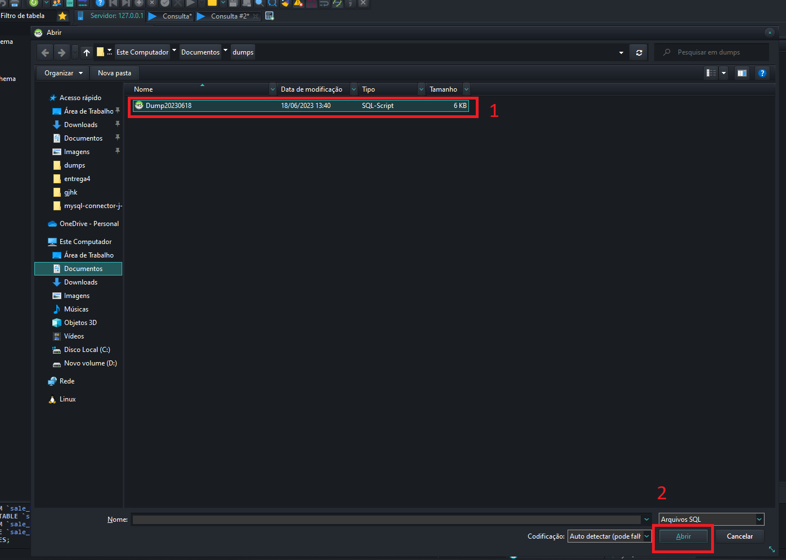
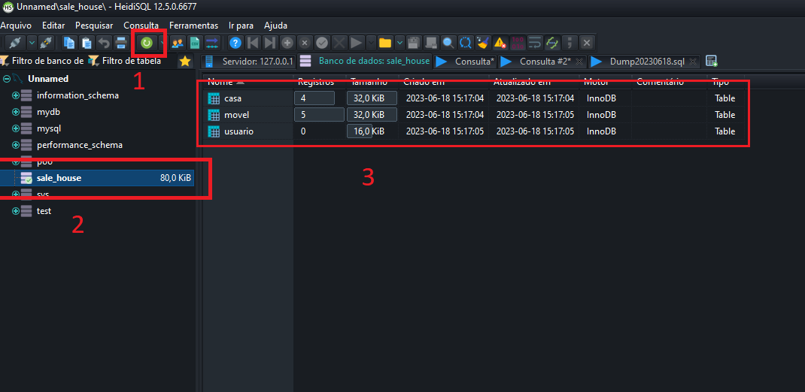
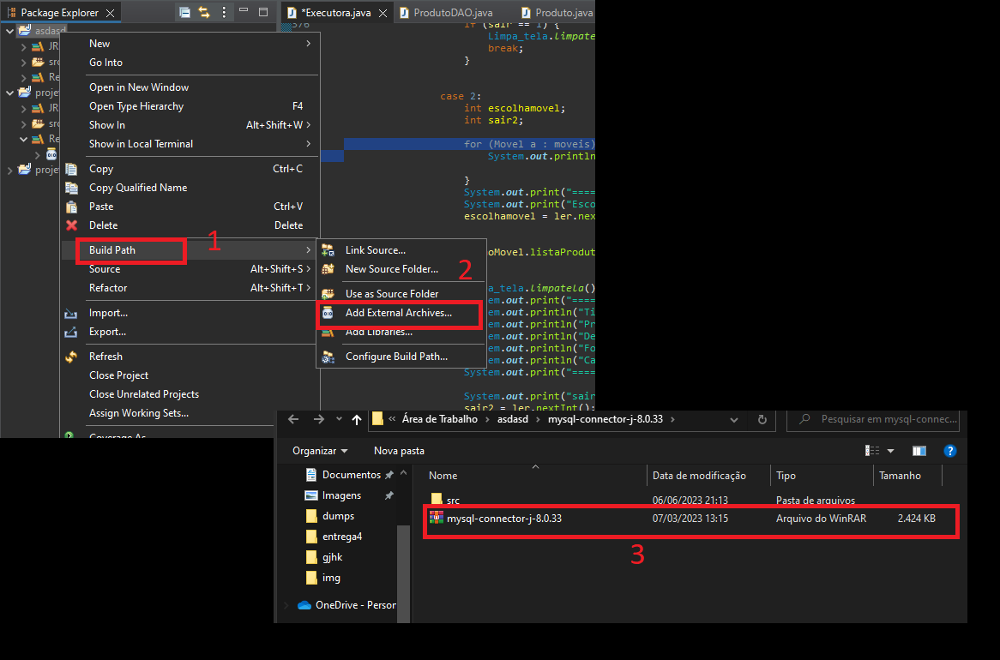
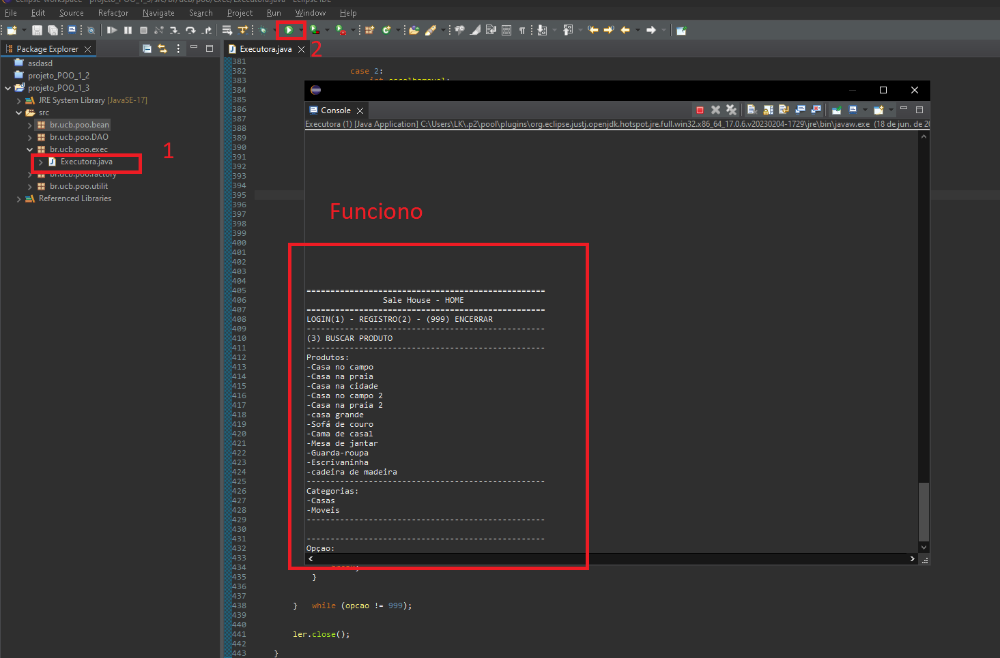

<h1>Projeto POO - Integração com Banco de Dados usando JDPC</h1>
    

        Este projeto utiliza Programação Orientada a Objetos (POO) e realiza a integração com um Banco de Dados usando JDPC.
    

    

        Antes de executar o sistema no Eclipse, é necessário rodar o DUMP. Faça o download dos arquivos necessários para isso.
    

      
    

        Após obter o DUMP, abra um cliente SQL (no meu caso, utilizo o HeidiSQL).
    
 
    

    
Execute a opção de DUMP:

    
    

    
Realize a execução:

    
    

    
Após a execução, verifique se foi concluída com sucesso:
  
    

 
<h2>Depois isso, vamos importar o driver JDPC</h2>

Primeiro, baixe o <a href="https://dev.mysql.com/downloads/connector/j/">driver JDPC</a>.

Após isso, abra o Eclipse;

E abra um projeto:

<h2>Sistema rodando</h2>

Após isso, basta jogar os arquivos que estão no SRC dos arquivos que foram baixados do git para dentro do SRC do projeto.

Após isso, basta pressionar F11 ou dar Run.

