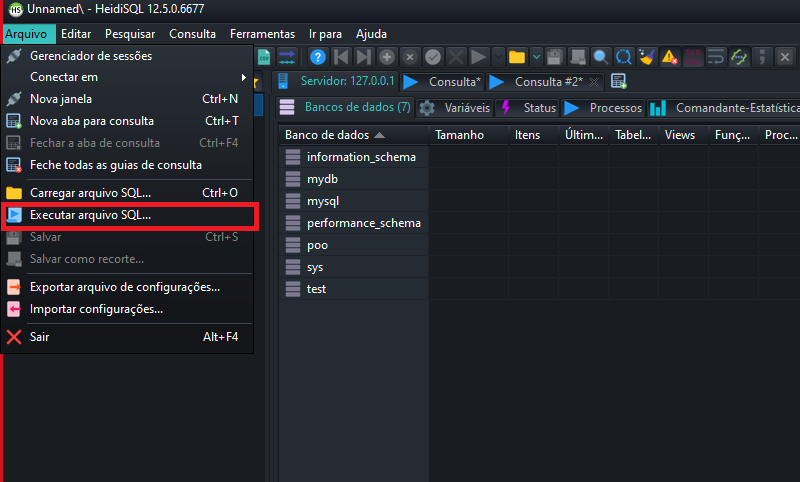
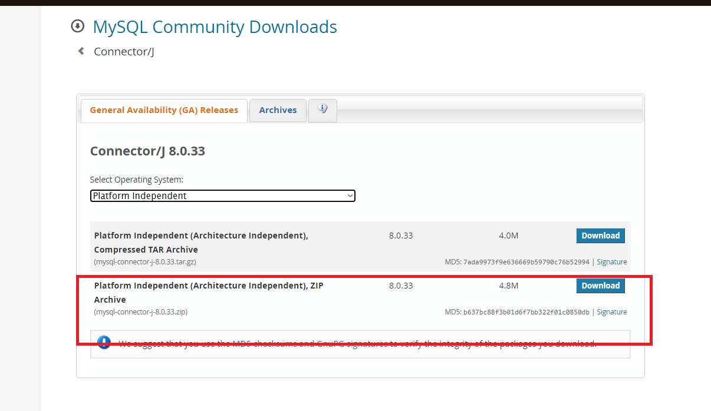
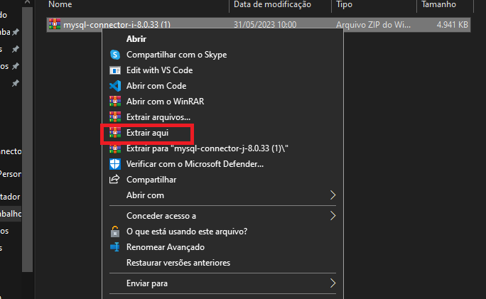
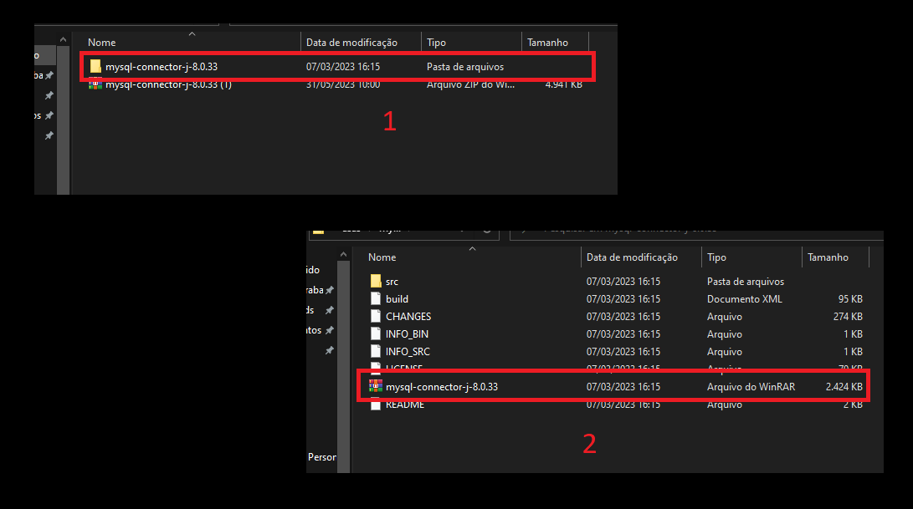

<h1> Projeto POO - integração BD usando JPDC</h1>

    Projeto de POO com integração com Banco de Dados usando JDPC

  

    Antes de rodar o sistema no Eclipse primeiro iremos rodar o DUMP (faça download dos arquivos)
  

      
  

    com o DUMP entre em algum cliente SQL (no meu caso uso o HeidiSQL)
  
 
  

  
Abra a opção de executar o DUMP

  
  

  
Execute:

  
  

  
Depois disso e só visualizar se deu certo 

  
  
  
  

  
   
  <h2>Primeiro vamos importa o drive JDPC</h2>
  
Primeiro baixar o <a href="https://dev.mysql.com/downloads/connector/j/">O drive JDPC</a>

  
  

  
Apos isso abra o Eclipse; 

  
E abra um projeto: 

  
  
  

  <h2>Apos isso so joga os arquivos q estão no SRC dos aquivos que foram baixados do git para dentro do SRC do projeto</h2>
  
